# VcomAI 3.0 — TDSA Fork: Developer Documentation

> **Fork:** TDSA-VcomAI-3.0 (based on VcomAI v4.3.0)
> **Config version:** 3.4.1
> **Arma 3 scripting language:** SQF

---

## Table of Contents

1. [Architecture Overview](#1-architecture-overview)
2. [File Layout](#2-file-layout)
3. [Initialization Chain](#3-initialization-chain)
4. [Configuration System](#4-configuration-system)
5. [Core Scheduler Loop](#5-core-scheduler-loop)
6. [SQUADBEH FSM — Squad Brain](#6-squadbeh-fsm--squad-brain)
7. [ForceMoveFSM — Per-Unit Movement](#7-forcemovefsm--per-unit-movement)
8. [AIDRIVEBEHAVIOR FSM — Vehicle AI](#8-aidrivebehavior-fsm--vehicle-ai)
9. [Detection & Awareness](#9-detection--awareness)
10. [Movement System](#10-movement-system)
11. [Cover System](#11-cover-system)
12. [Combat System](#12-combat-system)
13. [Static Weapons System (TDSA)](#13-static-weapons-system-tdsa)
14. [Artillery System](#14-artillery-system)
15. [Medical System](#15-medical-system)
16. [Rearming System](#16-rearming-system)
17. [Mine & Satchel System](#17-mine--satchel-system)
18. [Vehicle System](#18-vehicle-system)
19. [Enhanced Movement System](#19-enhanced-movement-system)
20. [Utility & Debug Functions](#20-utility--debug-functions)
21. [Event Handler Map](#21-event-handler-map)
22. [Global State Variables](#22-global-state-variables)
23. [Per-Group & Per-Unit Variables](#23-per-group--per-unit-variables)
24. [TDSA Modifications Summary](#24-tdsa-modifications-summary)

---

## 1. Architecture Overview

VcomAI is an Arma 3 AI enhancement mod structured in three layers:

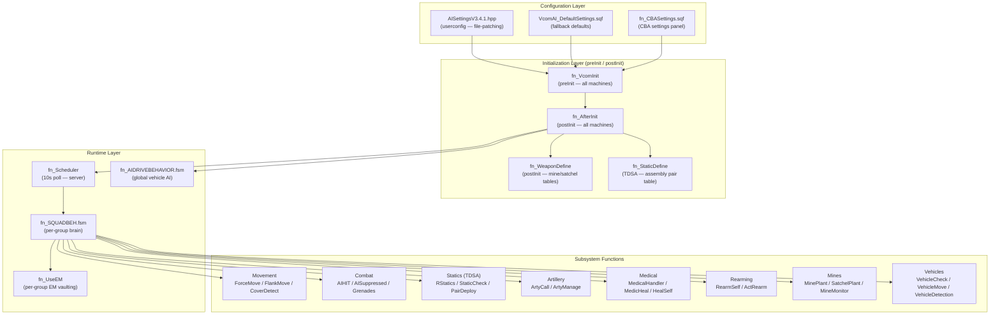

**Key design principles:**
- The server loads and broadcasts configuration; all machines execute it via `VCM_PublicScript`.
- Each AI group gets its own `SQUADBEH` FSM instance, managed by the scheduler.
- Subsystem functions are called *from* the FSM at timed intervals (every 5s, 30s, 60s, 300s).
- TDSA extensions operate entirely within the existing FSM timing by extending return values from `fn_RStatics` and adding two new functions (`fn_StaticDefine`, `fn_PairDeploy`).

---

## 2. File Layout

```
TDSA-VcomAI-3.0/
└── VcomTest.Stratis/
    ├── description.ext                    ← CfgFunctions, CfgRemoteExec, preInit EH
    ├── userconfig/VCOM_AI/
    │   └── AISettingsV3.4.1.hpp           ← Canonical runtime settings (file-patching)
    └── vcom/
        ├── cfgFunctions.hpp               ← Registers all VCM_fnc_* functions
        ├── FSMS/
        │   ├── fn_SQUADBEH.fsm            ← Per-group AI brain
        │   ├── fn_AIDRIVEBEHAVIOR.fsm     ← Global vehicle driving FSM
        │   ├── fn_ForceMoveFSM.fsm        ← Per-unit forced movement FSM
        │   └── fn_PLAYERSQUAD.fsm         ← (stub — not currently wired)
        └── Functions/
            ├── VcomAI_DefaultSettings.sqf ← Fallback config when no userconfig
            └── VCM_Functions/
                ├── fn_VcomInit.sqf
                ├── fn_AfterInit.sqf
                ├── fn_Scheduler.sqf
                ├── fn_CBASettings.sqf
                ├── fn_WeaponDefine.sqf
                ├── fn_StaticDefine.sqf    ← TDSA NEW
                ├── fn_PairDeploy.sqf      ← TDSA NEW
                ├── fn_StaticCheck.sqf     ← TDSA MODIFIED
                ├── fn_RStatics.sqf        ← TDSA MODIFIED
                ├── fn_PackStatic.sqf      ← TDSA MODIFIED
                └── [all other functions]
```

---

## 3. Initialization Chain

### Sequence Diagram

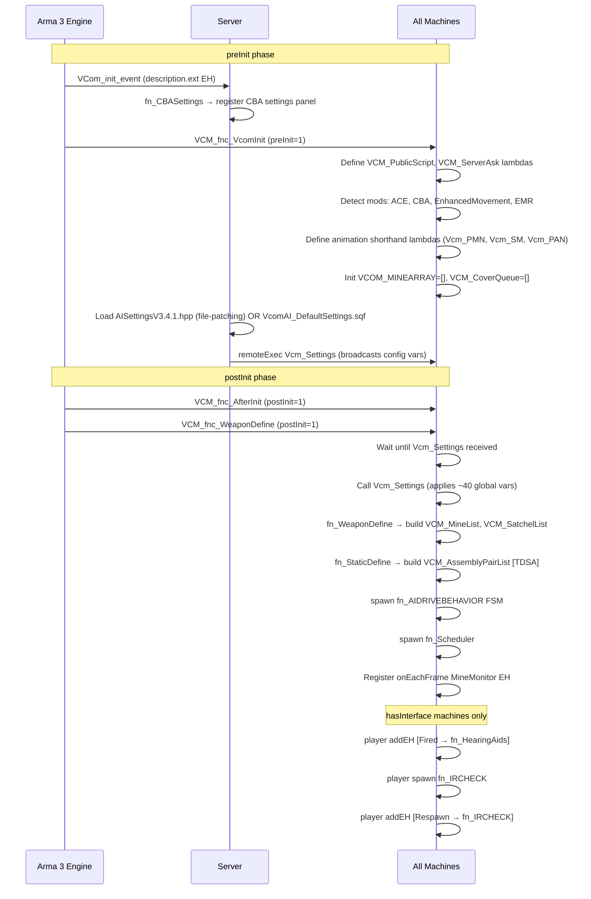

### Function Detail

#### `fn_VcomInit` (preInit)

Runs on **all machines** before the mission starts.

- Defines the two network lambdas used throughout:
  - `VCM_PublicScript` — calls a given function with given args on all machines (`remoteExecCall` with `0`)
  - `VCM_ServerAsk` — requests the server to re-broadcast a public variable
- On the **server only**: reads `Vcm_Settings` code block from `AISettingsV3.4.1.hpp` (if file-patching enabled and file exists) or `VcomAI_DefaultSettings.sqf`. Then remoteExecs `Vcm_Settings` so all clients receive it.
- Sets mod-detection booleans: `VCM_MEDICALACTIVE` (ACE), `CBAACT` (CBA), `VCOM_EM_ENABLED` (Enhanced Movement), `VCOM_EMR_ENABLED` (EMR variant).
- Defines compiled animation shortcuts: `Vcm_PMN` (`playMoveNow`), `Vcm_SM` (`switchMove`), `Vcm_PAN` (`playActionNow`).
- Initialises global arrays: `VCOM_MINEARRAY = []`, `VCM_CoverQueue = []`.

#### `fn_AfterInit` (postInit)

Runs on **all machines** after mission load. Spawns a thread that:

1. Calls `VCM_ServerAsk` to request `Vcm_Settings`, then `waitUntil` it arrives.
2. Calls `Vcm_Settings` to apply all configuration variables into global scope.
3. Sleeps 2 seconds (allows `WeaponDefine` postInit to complete).
4. Calls `fn_WeaponDefine` — builds mine and satchel lookup tables.
5. **[TDSA]** Calls `fn_StaticDefine` — builds assembly pair lookup table.
6. Spawns `fn_AIDRIVEBEHAVIOR` FSM (vehicle driving loop).
7. Spawns `fn_Scheduler` (group management loop).
8. If `hasInterface`: adds player `Fired` EH → `fn_HearingAids`; spawns `fn_IRCHECK`; adds `Respawn` EH → `fn_IRCHECK`.
9. Registers stacked EH: `onEachFrame → fn_MineMonitor`.

#### `fn_WeaponDefine` (postInit)

Scans `CfgVehicles` for land vehicle entries where units have `ItemCore` class weapons containing mine or bomb ammo. Builds:

- `VCM_MineList` — `[[vehicleClass, magazineClass, ammoClass, muzzle, roadPreferred], ...]`
- `VCM_SatchelList` — `[[vehicleClass, magazineClass, ammoClass, muzzle], ...]`

These are used by `fn_MinePlant` and `fn_SatchelPlant` to find the correct deployable weapon for a given unit's backpack.

---

## 4. Configuration System

### Settings Flow

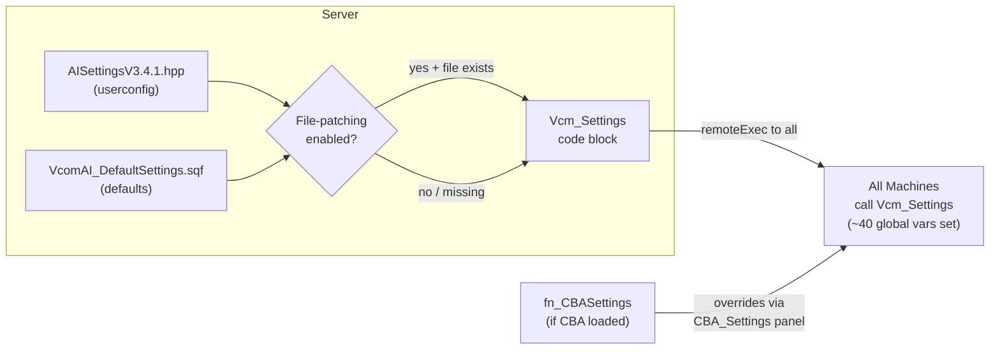

### Key Configuration Variables

| Variable | Default | Description |
|---|---|---|
| `Vcm_ActivateAI` | `true` | Master enable switch |
| `VCM_SIDEENABLED` | `[west,east,resistance]` | Which sides VcomAI governs |
| `VCM_ARTYENABLE` | `true` | Enable artillery AI |
| `VCM_ARTYDELAY` | `60` | Seconds between arty fire missions |
| `VCM_AIMagLimit` | `5` | Magazine count below which AI rearms |
| `VCM_MINECHANCE` | `75` | % chance to plant mine each FSM cycle |
| `VCM_RAGDOLL` | `true` | Enable ragdoll on hit |
| `VCM_RAGDOLLCHC` | `100` | % chance of ragdoll |
| `VCM_HEARINGDISTANCE` | `1200` | Radius (m) hearing unsilenced shots |
| `VCM_WARNDIST` | `1000` | Radius (m) for reinforcement calls |
| `VCM_WARNDELAY` | `30` | Delay (s) before calling for help |
| `VCM_STATICARMT` | `300` | Seconds before AI abandons a static |
| `VCM_StealVeh` | `false` | AI may commandeer vehicles |
| `VCM_ADVANCEDMOVEMENT` | `true` | Enable flanking waypoints |
| `VCM_FRMCHANGE` | `true` | Enable formation changes |
| `VCM_SKILLCHANGE` | `true` | VcomAI sets AI skill values |
| `VCM_DISEMBARKRANGE` | `500` | Enemy distance triggering dismount |
| `VCM_AISNIPERS` | `true` | Special sniper/marksman logic |
| `Vcm_DrivingActivated` | `false` | Experimental vehicle pathfinding |
| `Vcm_GrenadeChance` | `10` | % chance to throw grenade |
| `Vcm_SmokeChance` | `10` | % chance to throw smoke on hit |
| `Vcm_UseStaticWeapons` | `false` | AI deploy static weapons from backpacks |
| `Vcm_AI_EM` | `true` | Use Enhanced Movement vaulting |
| `VCM_USECBASETTINGS` | `true` | Prefer CBA settings panel |

#### `fn_CBASettings`

Registers ~50 settings into the CBA settings panel under categories:
- **VCOM SETTINGS** — all main toggles and numeric values (CHECKBOX / SLIDER types)
- **VCOM AI West/East/Resistance/General Skill** — skill arrays per side

Each setting's callback directly assigns the global variable and calls `publicVariable` so the change propagates to all machines.

---

## 5. Core Scheduler Loop

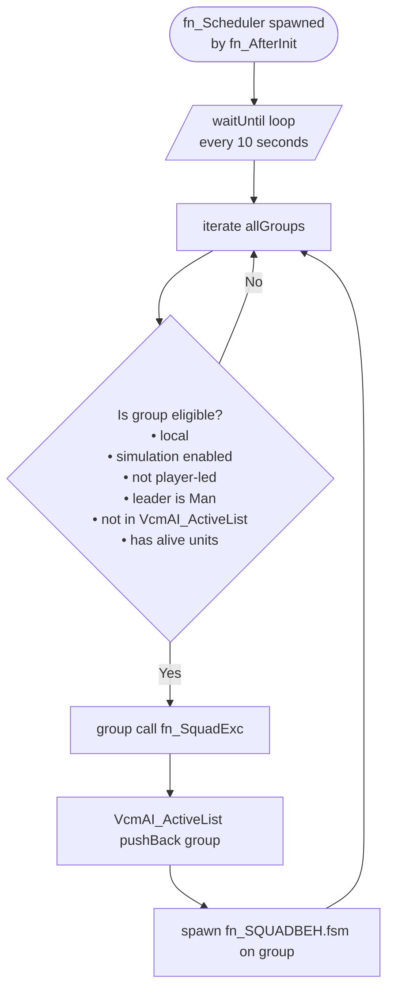

#### `fn_Scheduler`

- Runs on the **server** only (spawned from `fn_AfterInit`).
- Polls `allGroups` every 10 seconds.
- Eligibility checks prevent double-spawning FSMs and skip player groups, dead groups, and non-local groups.
- Delegates to `fn_SquadExc` which does the actual push + spawn.

#### `fn_SquadExc`

- `_this spawn VCM_fnc_SQUADBEH` — launches the FSM on the group.
- `VcmAI_ActiveList pushback _this` — prevents the scheduler from re-spawning until FSM exits.

---

## 6. SQUADBEH FSM — Squad Brain

This is the central intelligence for each AI group. One FSM instance runs per governed group.

### State Machine Diagram

```mermaid
stateDiagram-v2
    [*] --> Begin_State
    Begin_State --> Exit_FSM : group disabled / wrong side / player-led / non-Man leader
    Begin_State --> Start_Point : valid group → init variables + EHs + skills

    Start_Point --> Simulation_Pause : leader simulation disabled
    Simulation_Pause --> Start_Point : simulation re-enabled (10s check)

    Start_Point --> Exit_FSM : group dead / ungoverned / wrong side

    Start_Point --> Full_Check : every 30s
    Full_Check --> Start_Point

    Start_Point --> RearmCheck : every 60s
    RearmCheck --> Start_Point

    Start_Point --> TwoMinuteChecks : every 120s
    TwoMinuteChecks --> Start_Point

    Start_Point --> Five_Minute_Checks : every 300s
    Five_Minute_Checks --> Start_Point

    Start_Point --> Artillery_Pause : group has artillery
    Artillery_Pause --> Start_Point : artillery disabled

    Start_Point --> Leader_Cycle_Beg : every ~5s (default)
    Leader_Cycle_Beg --> Hold_WP : HOLD/GUARD/SENTRY waypoint active
    Hold_WP --> Start_Point

    Leader_Cycle_Beg --> Vehicle_Brain : leader in vehicle
    Vehicle_Brain --> Transport_Orders : transport with cargo
    Vehicle_Brain --> Attack_Orders : combat vehicle
    Transport_Orders --> Start_Point
    Attack_Orders --> Start_Point

    Leader_Cycle_Beg --> Inf_Combat_Brain : leader on foot in combat
    Inf_Combat_Brain --> Arty_Check
    Inf_Combat_Brain --> Flank_Orders
    Inf_Combat_Brain --> CheckIfStatic
    Inf_Combat_Brain --> MinePlant
    Inf_Combat_Brain --> SatchelPlant
    Inf_Combat_Brain --> ArmStatics
    Inf_Combat_Brain --> Clear_Building
    Inf_Combat_Brain --> Combat_Movement
    Inf_Combat_Brain --> Grenade_Check
    Arty_Check --> Start_Point
    Flank_Orders --> Start_Point
    CheckIfStatic --> Start_Point
    MinePlant --> Start_Point
    SatchelPlant --> Start_Point
    ArmStatics --> Start_Point
    Clear_Building --> Start_Point
    Combat_Movement --> Start_Point
    Grenade_Check --> Start_Point

    Exit_FSM --> [*] : remove from VcmAI_ActiveList, remove EHs
    Exit_FSM_1 --> [*]
    Exit_FSM_2 --> [*]
```

### FSM Timing Overview

```mermaid
gantt
    title SQUADBEH FSM Timing (one cycle)
    dateFormat X
    axisFormat %ss

    section Every ~1s
    Start_Point dispatch      :0, 1
    Leader_Cycle_Beg          :0, 1

    section Every 30s
    Full_Check (KitChk, Medical, VehCheck, Formation) :0, 30

    section Every 60s
    RearmCheck (RearmSelf, ArtyManage) :0, 60

    section Every 120s
    TwoMinuteChecks           :0, 120

    section Every 300s
    Five_Minute_Checks        :0, 300
```

### Begin_State (Initialization)

On entry, the FSM:

1. Sets `group setVariable ["VCOM_FSMH", _thisFSM]` — stores handle for external reference.
2. Iterates all non-player units in the group, adding four event handlers (tracked in `_Eventhandlers`):
   - `Killed` → `VCM_fnc_ClstWarn`
   - `Fired` → `VCM_fnc_HearingAids`
   - `Hit` → `VCM_fnc_AIHIT`
   - `Suppressed` → `VCM_fnc_AISuppressed`
   - `PathCalculated` → sets `VCM_MVWP` variable on unit
3. Applies initial skills via `VCM_AIDIFSET` code block.
4. Spawns `group spawn VCM_fnc_UseEM` — Enhanced Movement loop for this group.
5. Initialises all timer variables to `time - large_offset` so first-cycle checks fire immediately.
6. **[TDSA]** Initialises `private _PairList = []`.

### Full_Check (every 30 seconds)

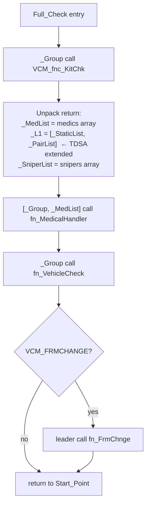

### Infantry Combat Brain (Leader_Cycle → Inf_Combat_Brain)

Dispatches combat actions by priority (higher number = higher priority):

| Priority | State | Function Called |
|---|---|---|
| 106 | ArmStatics | `fn_ArmStatics` |
| 105 | Flank_Orders | `fn_FlankMove` |
| 105 | Clear_Building | `fn_ClearBuilding` |
| 104 | Combat_Movement | `fn_ForceMove` via CoverQueue |
| 92 | CheckIfStatic | `fn_StaticCheck` + `fn_PairDeploy` |
| 90 | Combat_END | resets combat state |
| 86 | MinePlant | `fn_MinePlant` |
| 85 | SatchelPlant | `fn_SatchelPlant` |
| 84 | Arty_Check | `fn_ArtyCall` |
| 60 | Grenade_Check | `fn_ForceGrenadeFire` |

---

## 7. ForceMoveFSM — Per-Unit Movement

A lightweight FSM spawned per unit to execute point-to-point movement with automatic abort conditions.

### Parameters

```
[_Unit, _Position, _Proximity, _Timeout, _forceSpeed=-1, _NoWait=false, _ClearingStructure=false]
```

### State Diagram

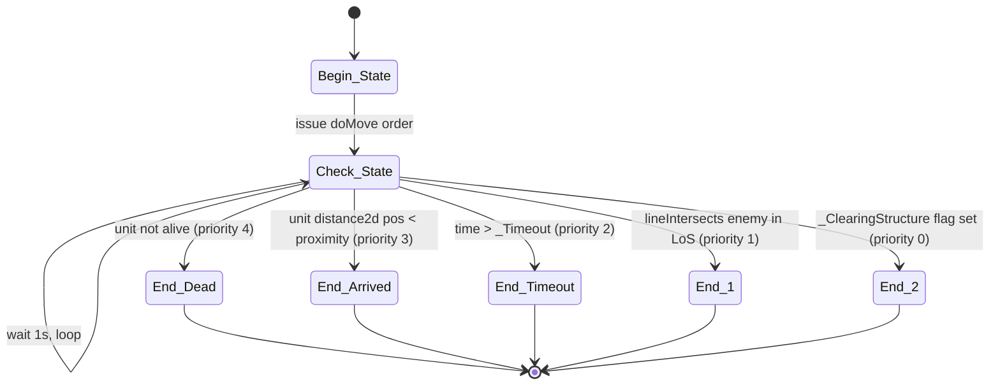

### Callers

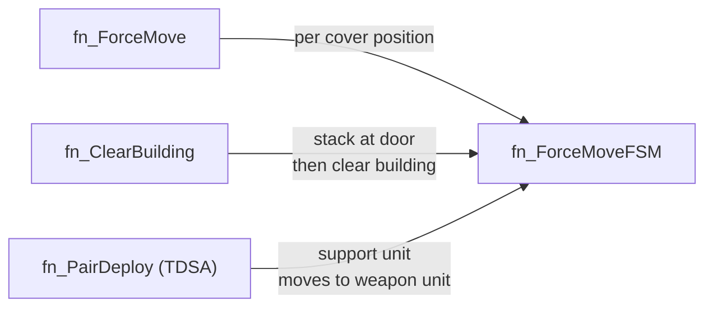

---

## 8. AIDRIVEBEHAVIOR FSM — Vehicle AI

A single global FSM spawned once by `fn_AfterInit` that manages AI vehicle driving improvements.

### State Diagram

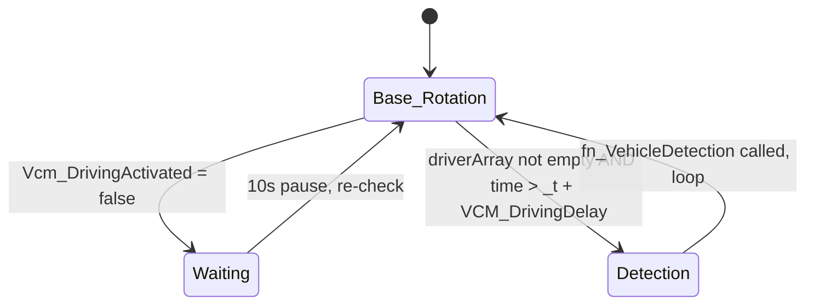

### Data Flow

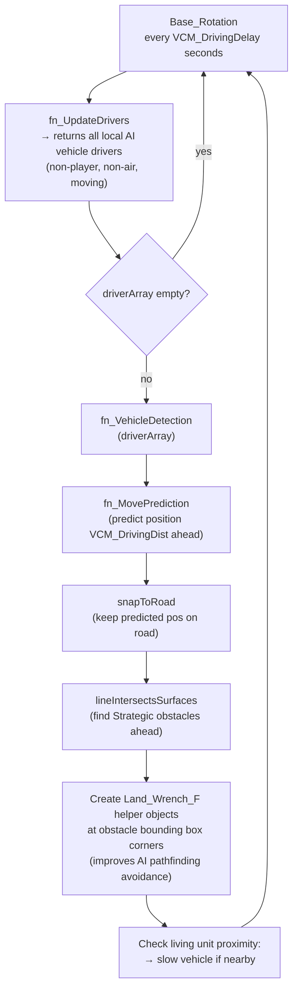

---

## 9. Detection & Awareness

### Function Relationships

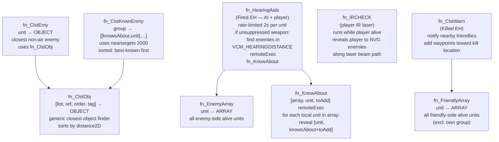

#### `fn_EnemyArray`

**Signature:** `unit call VCM_fnc_EnemyArray → ARRAY`

Returns all alive units on sides that are enemies to the calling unit's side. Used as input to `fn_ClstEmy` and `fn_HearingAids`.

#### `fn_FriendlyArray`

**Signature:** `unit call VCM_fnc_FriendlyArray → ARRAY`

Returns all alive units on friendly sides, excluding the unit's own group. Used by `fn_ClstWarn`, `fn_SniperEngage`, `fn_ArtyCall`.

#### `fn_ClstObj`

**Signature:** `[list, reference, order, tag] call VCM_fnc_ClstObj → OBJECT|[0,0,0]`

Generic sorted-closest finder. Reference can be OBJECT, STRING (position), ARRAY (position), or GROUP (leader). Returns `[0,0,0]` if nothing found.

#### `fn_ClstEmy`

**Signature:** `unit call VCM_fnc_ClstEmy → OBJECT|[0,0,0]`

Wraps `fn_ClstObj` with the enemy array filtered to non-air units.

#### `fn_ClstKnwnEnmy`

**Signature:** `group call VCM_fnc_ClstKnwnEnmy → [[knowsAbout, unit], ...]`

Uses `neartargets 2000` on the group leader to get AI awareness data. Returns sorted array (index 0 = best-known enemy).

#### `fn_KnowAbout`

**Signature:** `[unitArray, targetUnit, amountToAdd] remoteExec "VCM_fnc_KnowAbout"`

Propagates knowledge of `targetUnit` to all local units in `unitArray`. Increments each unit's `knowsAbout` value by `amountToAdd`.

#### `fn_HearingAids`

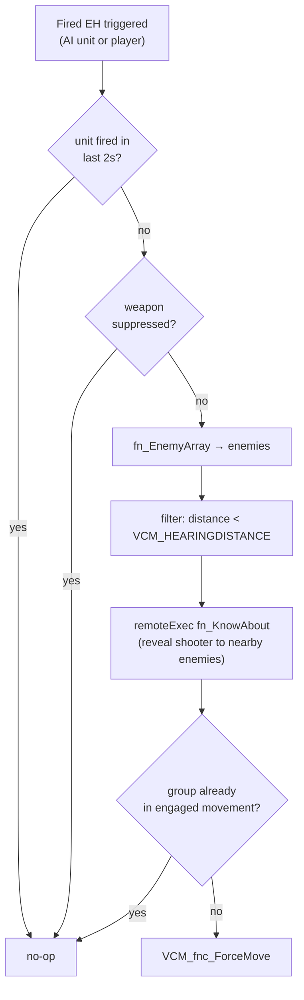

#### `fn_ClstWarn` (Killed EH)

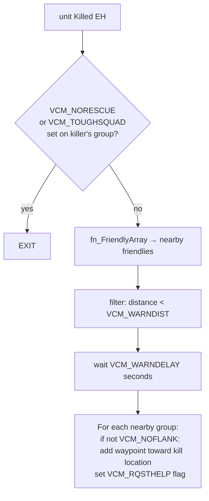

#### `fn_IRCHECK`

Runs continuously while `alive player`. When player fires a weapon with an IR laser attachment: casts `lineIntersectsSurfaces` along the laser beam. Any enemy unit with NVG enabled within the beam's path has their `knowsAbout` raised — effectively making them aware of the player's position.

---

## 10. Movement System

### Function Call Map

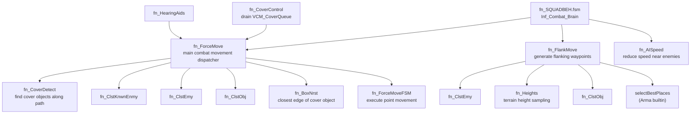

#### `fn_ForceMove`

**Signature:** `[squadLeader] call VCM_fnc_ForceMove`

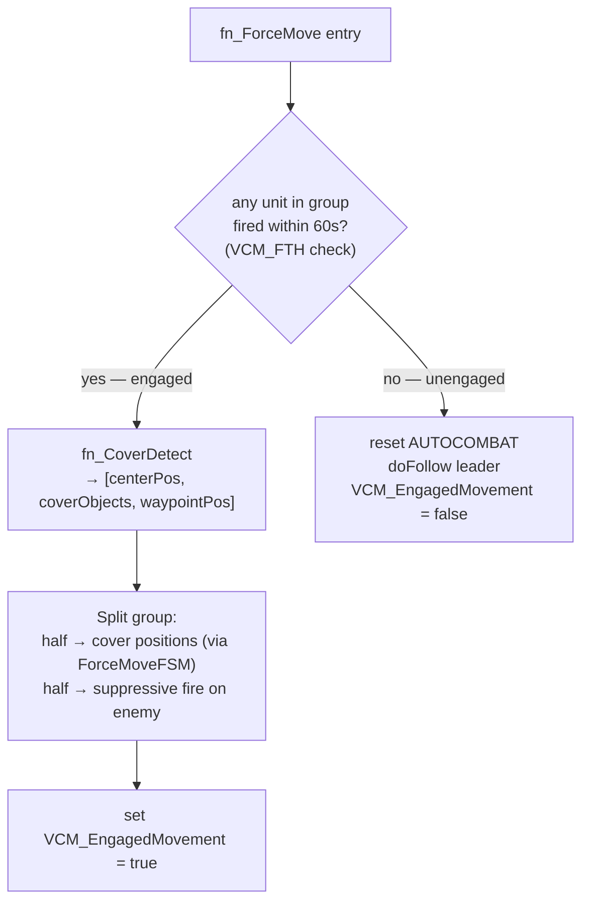

#### `fn_FlankMove`

**Signature:** `[leader] spawn VCM_fnc_FlankMove`

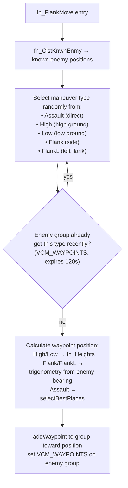

#### `fn_CoverDetect`

**Signature:** `[centerUnit, searchSize] call VCM_fnc_CoverDetect → [centerPosASL, coverObjects, waypointPos]`

- Finds terrain objects and vehicles in the area using `nearestObjects`.
- Groups cache detected cover in `GEN_GridArray` to avoid re-scanning.
- Selects objects that face toward the current waypoint direction.
- Returns best cover position for movement pathing.

#### `fn_FindCover`

**Signature:** `[leader] call VCM_fnc_FindCover`

- Finds nearest solid objects (all 3 dimensions ≥ 1.5m).
- Orders units to take positions behind cover, suppressing enemy first.
- Falls back to vanilla Arma cover approach if no objects found.

#### `fn_AISpeed`

**Signature:** `[squadLead] call VCM_fnc_AISpeed`

- If known enemy within 50m: `setSpeedMode "LIMITED"` (speed 1).
- Otherwise: `setSpeedMode "NORMAL"` (speed -1 / default).

#### `fn_MovePrediction`

**Signature:** `[unit, multiplier] call VCM_fnc_MovePrediction → [x,y,z]`

Simple linear extrapolation: `position + velocity * multiplier`. Used by vehicle driving code to predict where a vehicle will be.

---

## 11. Cover System

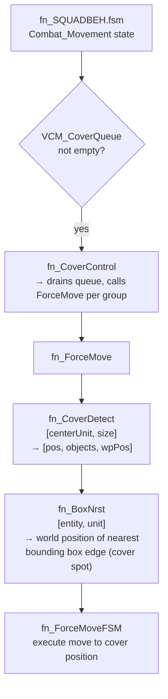

#### `fn_CoverControl`

Drains the global `VCM_CoverQueue` array. For each group entry, calls `fn_ForceMove`. After processing, clears the queue.

#### `fn_BoxNrst`

**Signature:** `[entity, unit] call VCM_fnc_BoxNrst → ARRAY (world position)`

Calculates the four bounding box face positions (left, right, front, rear) of `entity` and returns the one closest to `unit`. Used to find the nearest edge of a cover object to hide behind.

---

## 12. Combat System

### Event Handler Combat Pipeline

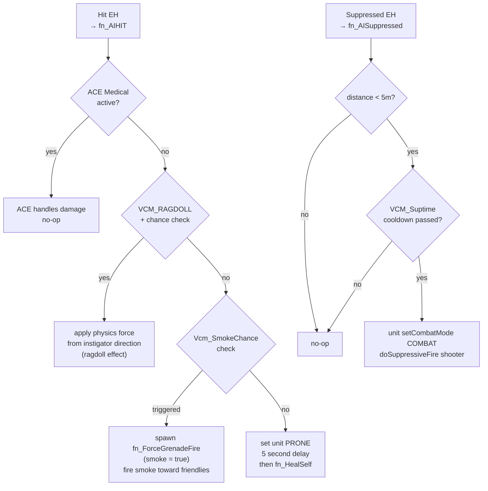

#### `fn_AIHIT`

**Signature:** `[unit, source, damage, instigator] call VCM_fnc_AIHIT` (from Hit EH)

- If ACE Medical is active (`VCM_MEDICALACTIVE`): exits immediately (ACE handles wound state).
- If `VCM_RAGDOLL` and `random 100 < VCM_RAGDOLLCHC`: applies physics impulse vector from instigator direction.
- Otherwise: may throw smoke (`Vcm_SmokeChance`), sets unit PRONE for 5 seconds, then calls `fn_HealSelf`.

#### `fn_AISuppressed`

**Signature:** `[unit, distance, shooter, ...] call VCM_fnc_AISuppressed` (from Suppressed EH)

- Only reacts if shooter is within 5m and cooldown (`VCM_Suptime`) has passed.
- Sets unit to COMBAT mode and issues suppressive fire on shooter.

#### `fn_ForceGrenadeFire`

**Signature:** `[unit, isGrenade, force] spawn VCM_fnc_ForceGrenadeFire`

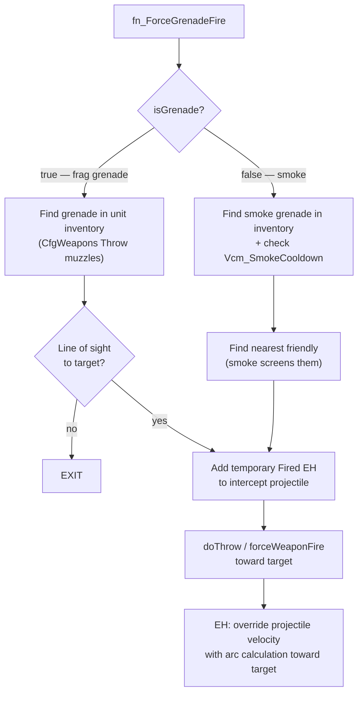

#### `fn_RangeEngage`

**Signature:** `[group, sniperList] call VCM_fnc_RangeEngage`

For non-sniper units: if a known enemy appears within index 15 of `fn_ClstKnwnEnmy`, there is a 50% chance per unit to check line of sight and issue `doSuppressiveFire` for 2–6 rounds.

#### `fn_SniperEngage`

**Signature:** `[snipers, group] call VCM_fnc_SniperEngage`

```mermaid
flowchart TD
    SE["fn_SniperEngage"] --> ITER["for each sniper in sniperList"]
    ITER --> TGT["fn_ClstKnwnEnmy → best known enemy"]
    TGT --> DIST["measure distance to enemy"]
    DIST --> SKILL["linearConversion[1000,2000,dist,1,0.5]\n→ scale skill: closer = more accurate"]
    SKILL --> FIRE["forceWeaponFire sniper rifle\nsetUnitTrait [spotDistance=1, spotTime=1]"]
```

#### `fn_SniperList`

**Signature:** `group call VCM_fnc_SniperList → ARRAY`

Finds units carrying a weapon with optic `distanceZoomMax > 800`. Sets `spotTime=1`, `spotDistance=1`, `customAimCoef=0` on each.

---

## 13. Static Weapons System (TDSA)

This is the most extensively modified system in the TDSA fork. The original VcomAI had solo-deploy only; TDSA adds cooperative two-person deployment using Arma's `assembleInfo` config.

### System Overview

```mermaid
graph TD
    subgraph Init["Initialization (fn_AfterInit)"]
        SD["fn_StaticDefine\nScan CfgVehicles assembleInfo\n→ VCM_AssemblyPairList\n  [[weaponBag, supportBag, vehicleClass],...]"]
    end

    subgraph Periodic["Full_Check every 30s"]
        RS["fn_RStatics\n(group) → [staticList, pairedList, satchelList, mineList]"]
        RS -->|"_StaticList"| SC["fn_StaticCheck\n(solo-deploy handler)"]
        RS -->|"_PairList"| PD["fn_PairDeploy [TDSA]\n(two-person deploy handler)"]
        SC -->|"on deploy"| PS["fn_PackStatic\n(monitor + teardown)"]
        PD -->|"on deploy"| PS
    end

    subgraph Ongoing["Leader_Cycle every ~5s"]
        ARS["fn_ArmStatics\nfind nearby abandoned statics\nassign nearest unit to man them"]
        ES["fn_EmptyStatic\ncheck if group has any static nearby"]
    end

    SD --> RS
```

#### `fn_StaticDefine` (TDSA NEW)

**Signature:** `[] call VCM_fnc_StaticDefine`

Scans `CfgVehicles` for vehicle entries with `assembleInfo` where:
- `primary = 1` — this is the weapon bag (the primary carrier)
- `base[]` is non-empty — requires a partner support bag

Builds `VCM_AssemblyPairList = [[weaponBagClass, supportBagClass, assembledVehicleClass], ...]`.

Used by `fn_RStatics` to identify and pair bag carriers.

#### `fn_RStatics` (TDSA MODIFIED)

**Signature:** `group call VCM_fnc_RStatics → [staticList, pairedList, satchelList, mineList]`

Original returned `[staticList, satchelList, mineList]`. TDSA extends with `pairedList`.

```mermaid
flowchart TD
    RS["fn_RStatics"] --> ITER["iterate group units\n(skip players, skip VCM_InDeployment units)"]
    ITER --> BP{"unit has backpack?"}
    BP -->|"no"| ITER
    BP -->|"yes"| PAIR{"backpack in\nVCM_AssemblyPairList?"}
    PAIR -->|"primary (weapon bag)"| WC["add to _weaponCarriers"]
    PAIR -->|"support bag"| SC2["add to _supportCarriers"]
    PAIR -->|"unknown → check parent class"| SOLO{"StaticWeapon or\nWeapon_Bag_Base parent?"}
    SOLO -->|"yes"| SLIST["add to _staticList (solo-deploy)"]
    SOLO -->|"no"| MINE["fn_HasMine\ncheck for mine/satchel"]
    MINE --> MLIST["add to mine/satchel lists"]
    
    WC --> PMATCH["Pair-matching pass:\nfor each weaponCarrier:\n  find available supportCarrier\n  → add [weaponUnit, supportUnit, vehicleClass,\n         weaponBagClass, supportBagClass]\n    to _pairedList"]
    SC2 --> PMATCH
    
    PMATCH --> ARTY["fn_CheckArty per unit\n(if VCM_ARTYENABLE)"]
    ARTY --> RETURN["return [_staticList, _pairedList, _satchelList, _mineList]"]
```

#### `fn_StaticCheck` (TDSA MODIFIED)

**Signature:** `[staticList] call VCM_fnc_StaticCheck → filteredStaticList`

```mermaid
flowchart TD
    SCHECK["fn_StaticCheck"] --> ITER["iterate _StaticList entries"]
    ITER --> DEAD{"unit dead?"}
    DEAD -->|"yes"| REMOVE["remove from list"]
    DEAD -->|"no"| PAIR{"TDSA: backpack has\nnon-empty assembleInfo.base[]?\n(pair-required bag)"}
    PAIR -->|"yes"| SKIP["skip — handled by fn_PairDeploy"]
    PAIR -->|"no"| UAV{"vehicle type is UAV?"}
    UAV -->|"yes"| UAVDEP["createVehicle UAV\nassign crew, join group\ndoMove toward enemy\nmark _StaticList synchronously [TDSA fix]"]
    UAV -->|"no"| SOLOQ{"enemy in range?\n(150-800m from leader)"}
    SOLOQ -->|"no"| SKIP
    SOLOQ -->|"yes"| SOLODEP["createVehicle static\nspawn positioning + assignment thread\nset VCM_InDeployment = true\nfn_PackStatic for teardown"]
```

#### `fn_PairDeploy` (TDSA NEW)

**Signature:** `[pairList] call VCM_fnc_PairDeploy → filteredPairList`

```mermaid
flowchart TD
    PD["fn_PairDeploy"] --> ITER["iterate _PairList entries\n[weaponUnit, supportUnit, vehicleClass,\n weaponBagClass, supportBagClass]"]
    ITER --> DEADCHK{"both units dead?"}
    DEADCHK -->|"yes"| REMOVE["remove pair from list"]
    DEADCHK -->|"no"| BPCHK{"weapon unit\nstill has weapon bag?"}
    BPCHK -->|"no"| REMOVE
    BPCHK -->|"yes"| RANGE{"enemy 150–800m\nfrom group leader?"}
    RANGE -->|"no"| SKIP["keep pair, skip this cycle"]
    RANGE -->|"yes"| DEPLOY["set VCM_InDeployment=true on both units"]
    DEPLOY --> THREAD["spawn async deployment thread"]

    subgraph THREAD_BODY["Async Deployment Thread"]
        T1["support unit doMove to weapon unit"] --> T2{"arrived within 30s?"}
        T2 -->|"timeout"| T3["reset VCM_InDeployment flags\ndo nothing"]
        T2 -->|"arrived"| T4["play assembly animation"]
        T4 --> T5["createVehicle vehicleClass near weapon unit"]
        T5 --> T6["orient static toward enemy"]
        T6 --> T7["strip both units' backpacks"]
        T7 --> T8["assign weapon unit as gunner"]
        T8 --> T9["fn_PackStatic\n[gunner, weaponBagClass, static,\n supportUnit, supportBagClass]"]
    end
```

#### `fn_PackStatic` (TDSA MODIFIED)

**Signature:** `[gunner, backpackClass, static, supportUnit=objNull, supportBagClass=""] spawn VCM_fnc_PackStatic`

Monitors a deployed static weapon. Every 5 seconds, adjusts `_statictime`:
- `+3` if enemy is spotted
- `-5` if no enemy visible

When `_statictime < 1`: leaves vehicle, plays pack-up animation, deletes static, restores backpack to gunner. **[TDSA]** Also restores `supportBagClass` to `supportUnit` if provided.

```mermaid
stateDiagram-v2
    [*] --> Monitoring
    Monitoring --> Monitoring : enemy spotted → +3 statictime\nevery 5s
    Monitoring --> Monitoring : no enemy → -5 statictime\nevery 5s
    Monitoring --> Packing : statictime < 1
    Packing --> BackpackRestore : leave vehicle\nplay animation\ndelete static
    BackpackRestore --> [*] : addBackpack gunner\n[TDSA] addBackpack supportUnit
```

#### `fn_ArmStatics`

**Signature:** `[group] call VCM_fnc_ArmStatics`

Finds `StaticWeapon` objects within 150m of the group that have no crew. Assigns the nearest on-foot unit. That unit:
1. Moves to the weapon (`doMove`).
2. Gets in as gunner (`moveInGunner`).
3. Monitors: leaves if no enemy spotted for `VCM_STATICARMT` seconds, or if the group leader moves >200m away.

---

## 14. Artillery System

```mermaid
graph TD
    AM["fn_ArtyManage\n(RearmCheck every 60s)\nscans group vehicles for artilleryScanner=1\nbuilds VCM_ARTYLST\nreturns true if group has artillery"] -->|"_ArtyGroupBool=true"| AP["Artillery_Pause state in SQUADBEH\n(suspends other combat orders)"]
    
    CA["fn_ArtyCall\n(Arty_Check branch of Inf_Combat_Brain)\n[callGrp, enemyGrp, avgKnw, predictedLoc]"] --> CLEAN["clean dead units from VCM_ARTYLST"]
    CLEAN --> FARTY["find friendly artillery in VCM_ARTYSIDES"]
    FARTY --> ARTYQ{"artillery\navailable?"}
    ARTYQ -->|"no"| EXIT
    ARTYQ -->|"yes"| ACC["calculate accuracy from avgKnw:\n0-4: wide scatter\n4-10: medium\n>10: tight"]
    ACC --> TYPEQ{"enemy has\nvehicles?"}
    TYPEQ -->|"yes"| GUIDED["use guided/AT ammo\ncreate laser target on enemy vehicle"]
    TYPEQ -->|"no"| HE["use HE/cluster ammo"]
    GUIDED --> SAFE{"friendly within\n50m of target?"}
    HE --> SAFE
    SAFE -->|"yes"| EXIT2["abort — friendly fire risk"]
    SAFE -->|"no"| FIRE["doArtilleryFire with random offset positions\nrespect VCM_ARTYDELAY cooldown"]
```

#### `fn_CheckArty`

**Signature:** `unit call VCM_fnc_CheckArty`

Deprecated/legacy. Called by `fn_RStatics` per unit to add vehicles with `artilleryScanner=1` to `Vcm_ArtilleryArray`. Superseded by `fn_ArtyManage`.

---

## 15. Medical System

```mermaid
graph TD
    MH["fn_MedicalHandler\n[group, medList] call\n(Full_Check every 30s)"] --> ACE{"VCM_MEDICALACTIVE\n(ACE)?"}
    ACE -->|"no"| NOOP["no-op — vanilla handles damage"]
    ACE -->|"yes"| ITER["iterate damaged units in group"]
    ITER --> HS["unit call fn_HealSelf\n→ true if has FirstAidKit"]
    HS -->|"healed"| NEXT["next unit"]
    HS -->|"failed"| MEDQ{"medics available\nin medList?"}
    MEDQ -->|"no"| NEXT
    MEDQ -->|"yes"| NMED["fn_ClstObj → find nearest non-busy medic"]
    NMED --> HEAL["spawn fn_MedicHeal\n[medic, unit]"]
    HEAL --> NEXT
```

#### `fn_HealSelf`

**Signature:** `unit call VCM_fnc_HealSelf → BOOL`

If unit has `FirstAidKit` in inventory: sets `damage 0`, plays self-heal animation, returns `true`. Otherwise returns `false`.

#### `fn_MedicHeal`

**Signature:** `[medic, unit] spawn VCM_fnc_MedicHeal`

1. Sets `VCM_MBUSY = true` on medic.
2. Medic moves to within 75m of patient (`fn_ForceMoveFSM`).
3. Uses `HealSoldier` ACE action on patient.
4. Sets patient `damage 0`.
5. Clears `VCM_MBUSY`.

#### `fn_RMedics`

**Signature:** `group call VCM_fnc_RMedics → ARRAY`

Returns all on-foot (not in vehicle) units in the group with the `Medic` trait.

---

## 16. Rearming System

```mermaid
graph TD
    RS["fn_RearmSelf\ngroup call\n(RearmCheck every 60s)"] --> ITER["iterate group units"]
    ITER --> MAGSQ{"magazines < VCM_AIMagLimit?"}
    MAGSQ -->|"no"| NEXT
    MAGSQ -->|"yes"| SEARCH["search nearby units & vehicles\nfor matching ammo type"]
    SEARCH --> FOUND{"source found?"}
    FOUND -->|"no"| NEXT
    FOUND -->|"yes"| SPAWN["spawn fn_ActRearm\n[unit, source]"]
    SPAWN --> NEXT["next unit"]

    AR["fn_ActRearm\n[unit, source] spawn"] --> MOVETO["doMove toward source\n(within 5m)"]
    MOVETO --> REARM["use 'rearm' action on source"]
```

#### `fn_BoxNrst`

**Signature:** `[entity, unit] call VCM_fnc_BoxNrst → ARRAY`

Used by both cover detection and rearming to find the nearest edge of an object (ammo crate, vehicle) relative to a unit's position.

---

## 17. Mine & Satchel System

### Pipeline

```mermaid
graph TD
    WD["fn_WeaponDefine\n(postInit)\nbuilds VCM_MineList\nbuilds VCM_SatchelList"] --> MP

    KK["fn_KitChk → fn_RStatics\n→ fn_HasMine\nidentifies mine/satchel carriers\nin group"] --> FSM_MINE["SQUADBEH MinePlant / SatchelPlant states"]

    FSM_MINE --> MP["fn_MinePlant\ngroup spawn"]
    FSM_MINE --> SP["fn_SatchelPlant\n[unit, satchelArray] spawn"]

    MP --> PLACEMENT["Place mine:\n• enemy < 100m → panic plant (stay in place)\n• AT/SLAM (roadPreferred=true) → move to road\n• AP → play putdown animation\n→ register in VCOM_MINEARRAY"]

    SP --> BLDG["Find enemy building < 40m\nMove unit to building\nPlace satchel"]
    BLDG --> CLEAR["Wait for friendlies to clear > 10m\nDetonate"]

    MM["fn_MineMonitor\n(onEachFrame EH)\ncheck all VCOM_MINEARRAY entries"] --> PROX{"enemy < 2.5m\nfrom mine?"}
    PROX -->|"yes"| DET["enableSimulationGlobal mine\ndetonate after 0.25s\nremove from array"]
    PROX -->|"no"| DEAD{"mine dead?"}
    DEAD -->|"yes"| CLEAN["remove from array"]
```

#### `fn_HasMine`

**Signature:** `unit call VCM_fnc_HasMine → [hasSatchel, satchelObj, hasMine, satchelArray]`

Scans `magazinesAmmo` for entries matching `CfgAmmo` with `explosionType = "mine"` or `"bomb"`.

#### `fn_MinePlant`

For each unit in the group, rolls `VCM_MINECHANCE`. On success:
- Looks up matching mine class from `VCM_MineList` by backpack type.
- Fires mine (`fireAtTarget` / `forceWeaponFire`) using mine muzzle.
- If AT/SLAM (road-preferred): moves unit to nearest road first.
- If AP: plays crouch putdown animation.
- Registers placed mine: `VCOM_MINEARRAY pushBack [mineObject, side]`.

#### `fn_MineMonitor`

Called every frame via `onEachFrame` EH. Iterates `VCOM_MINEARRAY`:
- If enemy unit within 2.5m: `enableSimulationGlobal [mine, true]`, schedule detonation in 0.25s.
- If mine object is dead: remove from array.

---

## 18. Vehicle System

### Vehicle Decision Tree

```mermaid
flowchart TD
    SBEH["SQUADBEH Leader_Cycle_Beg"] --> INVEH{"group leader\nin vehicle?"}
    INVEH -->|"no"| INF["Infantry Brain"]
    INVEH -->|"yes"| VC["fn_VehicleCheck\n→ [allInVeh, vehArray]"]
    VC --> TRANS{"fn_IsTransport\n(any cargo occupied?)"}
    TRANS -->|"yes"| TRN["fn_VehicleMove\n[group, isTransport=true, vehArr]\n→ add TR UNLOAD waypoint near friendly"]
    TRANS -->|"no"| ATT["fn_VehicleMove\n[group, isTransport=false, vehArr]\n→ fn_FlankMove (vehicle assault)"]
    
    VC --> DISE{"enemy < VCM_DISEMBARKRANGE\nAND VCM_CARGOCHNG?"}
    DISE -->|"yes"| UNLD["setUnloadInCombat true\n(force dismount)"]
    DISE -->|"no"| HOLD["setUnloadInCombat false"]
    
    VC --> TURR["VCM_TURRETUNLOAD:\nprevent turret crew\nfrom leaving slightly-damaged vehicles"]
```

#### `fn_VehicleCheck`

**Signature:** `[group] call VCM_fnc_VehicleCheck → [allInVehicle, vehicleArray]`

- Checks if all group members are in vehicles.
- If `VCM_CARGOCHNG`: sets `setUnloadInCombat` based on enemy proximity vs `VCM_DISEMBARKRANGE` and vehicle damage.
- Always applies `VCM_TURRETUNLOAD` logic to turret positions.

#### `fn_vehiclecommandeer`

**Signature:** `group call VCM_fnc_vehiclecommandeer`

When `VCM_StealVeh` is enabled:
- If `VCM_ClassSteal`: restricts to crewmen for tracked vehicles/tanks, pilots for aircraft.
- Otherwise: any unlocked `LandVehicle` within `VCM_AIDISTANCEVEHPATH`.
- Calls `addVehicle` to assign vehicle to group.

#### `fn_VehicleDetection`

**Signature:** `driverArray spawn VCM_fnc_VehicleDetection` (called by AIDRIVEBEHAVIOR FSM)

For each driver in the array:
1. Predicts position `VCM_DrivingDist` ahead using `fn_MovePrediction`.
2. Snaps predicted position to nearest road.
3. Casts `lineIntersectsSurfaces` to find `Strategic` obstacles.
4. Creates `Land_Wrench_F` helper objects at obstacle bounding box edges — these improve Arma's native pathfinding avoidance.
5. Checks for living unit proximity; slows vehicle if needed.

---

## 19. Enhanced Movement System

Provides AI units with the ability to vault over low obstacles using the Enhanced Movement mod (or EMR variant).

### Sequence

```mermaid
sequenceDiagram
    participant FSM as SQUADBEH FSM\n(Begin_State)
    participant EM as fn_UseEM\n(per-group loop)
    participant EMX as fn_UseEMExec\n(per-unit spawn)
    participant BBO as fn_BabeOver\n(EM vault)
    participant FFSM as ForceMoveFSM

    FSM->>EM: group spawn fn_UseEM
    loop every 1 second while group alive
        EM->>EM: if random 100 <= Vcm_AI_EM_CHN
        EM->>EM: iterate on-foot units
        EM->>EM: skip if no VCM_MVWP (path waypoints)\nor VCM_VAULT active
        EM->>EMX: spawn fn_UseEMExec [unit, pathArray]
    end

    EMX->>EMX: lineintersectsSurfaces along movement path
    EMX->>EMX: check obstacle: height < 6m, width > 2m?
    alt climbable obstacle found
        EMX->>EMX: set VCM_VAULT = true
        EMX->>FFSM: doMove to intersection point
        FFSM-->>EMX: arrived
        EMX->>EMX: orient unit to face obstacle
        EMX->>EMX: playMoveNow "AmovPercMwlkSrasWrflDf"
        EMX->>BBO: [unit, climbOnly] call fn_BabeOver
        BBO->>BBO: raycast forward to detect climbable surface
        BBO->>BBO: call babe_em_fnc_em with top position
        BBO-->>EMX: complete
        EMX->>EMX: re-enable unit movement
        EMX->>EMX: VCM_VAULT = false
        EMX->>EMX: set VCM_AI_EM_CLDWN cooldown
    end
```

#### `fn_UseEM`

**Signature:** `group spawn VCM_fnc_UseEM`

Runs for the lifetime of the group. Every second: rolls `Vcm_AI_EM_CHN` % chance. If triggered, checks each on-foot unit for `VCM_MVWP` (path data stored by `PathCalculated` EH) and spawns `fn_UseEMExec` for eligible units.

#### `fn_UseEMExec`

**Signature:** `[unit, pathArray] spawn VCM_fnc_UseEMExec`

- Detects obstacle via `lineintersectsSurfaces` along path.
- If obstacle meets climbing criteria (height < 6m, width > 2m): executes vault.
- Sets `VCM_VAULT = true` during execution to prevent re-entry.
- After vault: applies `VCM_AI_EM_CLDWN` cooldown seconds.

#### `fn_BabeOver`

**Signature:** `[climber, climbOnly] call VCM_fnc_BabeOver`

Port of the `babe_em_fnc_em` Enhanced Movement vault function. Raycasts forward from the unit to detect climbable surfaces. If found and path is clear: calls the internal EM function with the top position of the obstacle.

---

## 20. Utility & Debug Functions

### `fn_KitChk`

**Signature:** `group call VCM_fnc_KitChk → [medicArray, itemList, sniperList]`

Aggregates three subsystem scans into one call made per `Full_Check`:

```mermaid
flowchart LR
    KC["fn_KitChk\ngroup call"] --> RMED["fn_RMedics\n→ medic array"]
    KC --> RS["fn_RStatics\n→ [staticList, pairedList, satchelList, mineList]\n  [TDSA: 4-element return]"]
    KC --> SL["fn_SniperList\n→ sniper array"]
    KC --> RETURN["return:\n[medicArray,\n [staticList, pairedList],  ← TDSA\n sniperList]"]
```

### `fn_FrmChnge`

**Signature:** `unit call VCM_fnc_FrmChnge → BOOL`

Changes group formation based on terrain context:

```mermaid
flowchart TD
    FC["fn_FrmChnge\nleader call"] --> CITYCHK{"city/village\nwithin 500m?"}
    CITYCHK -->|"yes"| STAG["STAG COLUMN\n(or COLUMN if in vehicle)"]
    CITYCHK -->|"no"| HILLCHK{"hill within 500m?"}
    HILLCHK -->|"yes"| LINE["LINE"]
    HILLCHK -->|"no"| LOCALCHK{"named location\nwithin 300m?"}
    LOCALCHK -->|"yes"| COL["COLUMN"]
    LOCALCHK -->|"no"| WEDGE["WEDGE (default)"]
    WEDGE --> VEHCHK{"in SAFE mode\nwith vehicles?"}
    VEHCHK -->|"yes"| FILE["FILE"]
```

### `fn_Heights`

**Signature:** `[obj, range, precision=50, sort=true] call VCM_fnc_Heights → [[height, [x,y,z]], ...]`

Grid-samples terrain heights in a square around `obj` with `precision` sample points. Returns sorted list used by `fn_FlankMove` to find high/low ground positions.

### `fn_WyptChk`

**Signature:** `group call VCM_fnc_WyptChk → ARRAY`

Returns current waypoint type only if it matches the "protected" types: `["HOLD","GUARD","UNLOAD","LOAD","TR UNLOAD","SENTRY","DESTROY"]`. Used by SQUADBEH to avoid overwriting mission-designer waypoints.

### `fn_IdleAnimations`

**Signature:** `[group] call VCM_fnc_IdleAnimations` (called from SQUADBEH `Start_Point`)

When group is not in combat:
- Rolls `Vcm_IdleAnimationChnc` % per unit.
- If triggered: plays a random animation from a pool of 25 (standing, on foot, not moving).
- Special: `acts_shieldfromsun_in` chains to `_out`; `acts_ambient_picking_up` attaches a random prop.

### `fn_ResetAnimation`

**Signature:** `[aiArray] call VCM_fnc_ResetAnimation`

Clears any active idle animations: `switchmove ""` on each unit.

### `fn_DebugText`

**Signature:** `[unit, text, timer=10] call VCM_fnc_DebugText`

When `VCM_DebugOld` is true: draws floating 3D text above a unit via `drawIcon3D` using stacked `onEachFrame` EH. Auto-removes when unit dies or timer expires.

### `fn_3DPathDebug`

**Signature:** `[unit, pathArray] call VCM_fnc_3DPathDebug` (from `PathCalculated` EH when `VCM_DebugAIPathing`)

Draws 3D arrows and waypoint icons along the unit's calculated path via `addMissionEventHandler ["Draw3D"]`. Cleans up on unit killed/deleted.

### `fn_Classname`

**Signature:** `[string] call VCM_fnc_Classname → config entry | "NotAClass"`

Returns `configFile >> "CfgVehicles" >> _name`. Used for parent-class checking in `fn_RStatics`.

### `fn_isFlatEmpty`

**Signature:** `[pos, dist, params] call VCM_fnc_isFlatEmpty → ARRAY`

Finds empty flat positions via Arma's `findEmptyPosition` + `isFlatEmpty` with provided params. Used by vehicle movement.

---

## 21. Event Handler Map

All event handlers registered and managed by VcomAI:

```mermaid
graph LR
    subgraph PerUnit["Per Non-Player Unit (SQUADBEH Begin_State)"]
        EH_K["Killed EH"] --> CW["fn_ClstWarn"]
        EH_F["Fired EH"] --> HA["fn_HearingAids"]
        EH_H["Hit EH"] --> AIHIT["fn_AIHIT"]
        EH_S["Suppressed EH"] --> AISUPP["fn_AISuppressed"]
        EH_P["PathCalculated EH"] --> MVWP["set VCM_MVWP variable"]
    end

    subgraph Player["Player (fn_AfterInit)"]
        PL_F["player Fired EH"] --> HA2["fn_HearingAids"]
        PL_R["player Respawn EH"] --> IRC["fn_IRCHECK"]
    end

    subgraph Global["Global (fn_AfterInit)"]
        OEF["onEachFrame EH\n(stacked via VCMMINEMONITOR)"] --> MM["fn_MineMonitor"]
    end

    subgraph Debug["Debug (conditional)"]
        D_PC["PathCalculated EH\n(VCM_DebugAIPathing)"] --> D3["fn_3DPathDebug"]
    end
```

All per-unit event handlers are stored in `_Eventhandlers` array within the SQUADBEH FSM and removed on FSM exit (`Exit_FSM` states).

---

## 22. Global State Variables

| Variable | Type | Set by | Used by |
|---|---|---|---|
| `VcmAI_ActiveList` | ARRAY of groups | `fn_SquadExc`, `fn_SQUADBEH` exit | `fn_Scheduler` (eligibility check) |
| `VCM_ARTYLST` | ARRAY of objects | `fn_ArtyManage` | `fn_ArtyCall` |
| `Vcm_ArtilleryArray` | ARRAY of objects | `fn_CheckArty` (legacy) | `fn_ArtyCall` (legacy path) |
| `VCOM_MINEARRAY` | `[[obj, side], ...]` | `fn_MinePlant` | `fn_MineMonitor` |
| `VCM_MineList` | `[[vehClass, magClass, ammoClass, muzzle, roadPref], ...]` | `fn_WeaponDefine` | `fn_MinePlant` |
| `VCM_SatchelList` | `[[vehClass, magClass, ammoClass, muzzle], ...]` | `fn_WeaponDefine` | `fn_SatchelPlant` |
| `VCM_AssemblyPairList` | `[[weaponBag, supportBag, vehicleClass], ...]` | `fn_StaticDefine` (TDSA) | `fn_RStatics` (TDSA) |
| `VCM_CoverQueue` | ARRAY of groups | `fn_ForceMove` | `fn_CoverControl` |
| `Vcm_Settings` | CODE block | server (VcomInit) | all machines (AfterInit) |

---

## 23. Per-Group & Per-Unit Variables

### Group Variables (`group setVariable`)

| Variable | Type | Set by | Meaning |
|---|---|---|---|
| `VCOM_FSMH` | FSM handle | SQUADBEH Begin_State | Reference to this group's FSM instance |
| `VCM_NOFLANK` | BOOL | mission designer | Disables flanking movement |
| `VCM_NORESCUE` | BOOL | mission designer | Group won't respond to help calls |
| `VCM_TOUGHSQUAD` | BOOL | mission designer | Group won't call for help |
| `Vcm_Disable` | BOOL | mission designer | Fully disables VcomAI on this group |
| `VCM_DisableForm` | BOOL | mission designer | Disables formation changes |
| `VCM_Skilldisable` | BOOL | mission designer | Disables skill changes |
| `VCOM_GARRISONED` | BOOL | `fn_Garrison` | Group is garrisoned in building |
| `VCM_MOVE2SUP` | BOOL | `fn_ClstWarn` | Group is responding to support call |
| `VCM_RQSTHELP` | BOOL | `fn_ClstWarn` | Group has pending help request (cooldown) |
| `VCM_WAYPOINTS` | `[[type, time], ...]` | `fn_FlankMove` | Waypoints assigned to enemy group (expires 120s) |
| `VCM_EngagedMovement` | BOOL | `fn_ForceMove` | Group is currently executing combat movement |

### Unit Variables (`unit setVariable`)

| Variable | Set by | Meaning |
|---|---|---|
| `VCM_FTH` | `fn_HearingAids` | Time unit last fired (used for 60s engaged window) |
| `VCM_MVWP` | PathCalculated EH | Last path waypoints from engine |
| `VCM_VAULT` | `fn_UseEMExec` | Unit is mid-vault (prevents re-entry) |
| `VCM_TO` | `fn_UseEMExec` | Vault start time (timeout guard) |
| `VCM_MBUSY` | `fn_MedicHeal` | Medic is currently occupied |
| `VCM_AVOID` | `fn_VehicleDetection` | Vehicle is currently avoiding an obstacle |
| `VCM_InDeployment` | `fn_PairDeploy` (TDSA) | Unit is mid paired-static deployment |
| `VCM_Suptime` | `fn_AISuppressed` | Time of last suppression response (cooldown) |
| `babe_em_vars` | `fn_BabeOver` | `[false, false, true]` EM state array |

---

## 24. TDSA Modifications Summary

All TDSA changes are marked with `// --- TDSA CHANGE: ... ---` / `// --- END TDSA CHANGE ---` in source.

### Change Overview

```mermaid
graph TD
    subgraph New["New Functions (TDSA)"]
        SD["fn_StaticDefine\nScan CfgVehicles for\nassembled weapon pairs\n→ VCM_AssemblyPairList"]
        PD["fn_PairDeploy\nCooperative two-person\nstatic weapon deployment"]
    end

    subgraph Modified["Modified Functions (TDSA)"]
        RS["fn_RStatics\n+ weapon/support carrier detection\n+ pair-matching pass\n+ extended return value\n+ skip players + VCM_InDeployment units"]
        SC["fn_StaticCheck\n+ gate: skip pair-required bags\n+ UAV spawn fix: sync list mutation"]
        PS["fn_PackStatic\n+ optional supportUnit param\n+ restore support bag on teardown"]
        AI["fn_AfterInit\n+ call fn_StaticDefine after WeaponDefine"]
        FSM["fn_SQUADBEH.fsm\n+ _PairList initialization\n+ extended Full_Check unpack\n+ PairDeploy call in CheckIfStatic"]
        CFG["cfgFunctions.hpp\n+ StaticDefine class\n+ PairDeploy class"]
    end

    SD --> RS
    RS -->|"pairedList"| PD
    PD --> PS
    RS -->|"staticList (filtered)"| SC
    SC --> PS
    AI --> SD
    FSM --> RS
    FSM --> PD
```

### Problem Solved

The original VcomAI could only deploy static weapons (mortars, HMGs, etc.) solo — one unit unpacked and operated the weapon alone. Many Arma 3 mods use a two-bag assembly system (e.g. RHS mortars: weapon bag + baseplate bag) that cannot be assembled by a single soldier.

TDSA's changes:
1. **At init** (`fn_StaticDefine`): Build a lookup table of all two-bag assembly pairs from game config.
2. **At kit check** (`fn_RStatics`): Identify which group members carry paired bags, match pairs, and return them separately from solo-deploy statics.
3. **In SQUADBEH** (`fn_PairDeploy`): Handle paired deployment as a cooperative async operation — support unit moves to weapon unit, both animate, weapon is assembled, packed away when no longer needed.
4. **On teardown** (`fn_PackStatic`): Return both bags to both soldiers.

### Interface Contract Changes

`fn_RStatics` return value changed:

| Version | Return Shape |
|---|---|
| Original | `[staticList, satchelList, mineList]` |
| TDSA | `[staticList, pairedList, satchelList, mineList]` |

`fn_KitChk` return value changed:

| Version | Return Shape |
|---|---|
| Original | `[medicArray, staticList, sniperList]` |
| TDSA | `[medicArray, [staticList, pairedList], sniperList]` |

`fn_SQUADBEH` `Full_Check` state updated to unpack `_L1 = [_StaticList, _PairList]`.

`fn_PackStatic` signature extended:

| Version | Params |
|---|---|
| Original | `[gunner, backpackClass, static]` |
| TDSA | `[gunner, backpackClass, static, supportUnit=objNull, supportBagClass=""]` |

---

*Documentation generated for TDSA-VcomAI-3.0 fork. Source: `VcomTest.Stratis/vcom/`*
